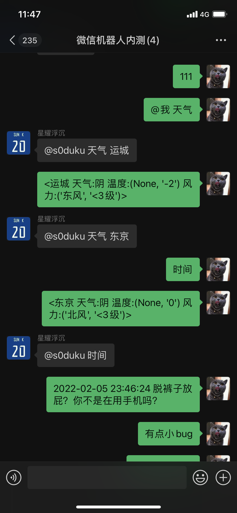
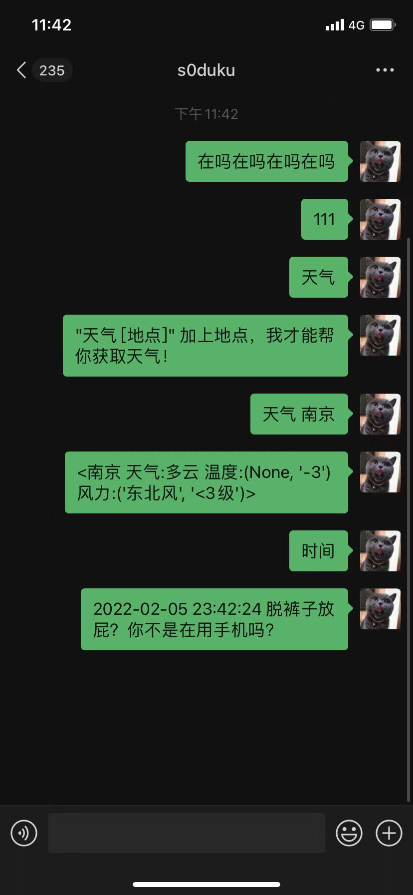

# Windows 微信 3.4.5.45 Python API

基于 Windows10 微信 3.4.5.45 逆向结果编写的 Python API 接口，可用于简单微信机器人编写。

 



## Requirement

* Windows10 微信 3.4.5.45
* Python 3
* pypiwin32
* DLL Injector (https://github.com/nefarius/Injector/)
* bs4
* requests
* lxml

## 已知问题

* 目前消息接收简单使用轮询，没有提供更好的同步手法手段，所以现在大批量数据过来，搞不好就丢数据，或者卡住一会儿。
* 各种隐性Bug?

## 样例

```
.\Injector.exe -n wechat.exe -i pywechat\WeChatCore\wechathelper\wechat.dll
// 注入登入好的微信进程
python main.py
// 启动 python 前端

```

```
.\Injector.exe -n wechat.exe -e pywechat\WeChatCore\wechathelper\wechat.dll
// 卸载注入

```

### main.py

```
from lib2to3.pgen2.token import tok_name
from pywechat.WeChatMsg.WeChatMsgSrv import WeChatMsgSrv
from pywechat.WeChatMsg.WeChatTextRecv import WeChatTextRecv
from pywechat.WeChatMsg.WeChatFifo import WeChatFifo
from pywechat.RobotApp.Weather import Weather
import time


srv = WeChatMsgSrv()
fifo = WeChatFifo()

srv.start()

print("\nStart Wechat Srv\n")

my_chatroom_name = 's0duku'

chatroom_payload = '@{}\u2005'.format(my_chatroom_name)
chatroom_payload1 = '@{}'.format(my_chatroom_name)

def robot_loop():
    print("Start Wechat Robot\n")
    while True:
        msg = srv.getMsg()
        if not msg:
            continue
        id,wxid,text = msg
        _,nickname,_ = fifo.userInfo(wxid)
        if text.startswith(chatroom_payload1):
            if text.startswith(chatroom_payload):
                text = text[len(chatroom_payload):]
            else:
                text = text[len(chatroom_payload1):]
            print("[REPLY TO] {}: {}".format(nickname,text))
            fifo.sendText(id,robot_exec(text))
        else:
            print("[NORMAL MSG] {}: {}".format(nickname,text))


def robot_exec(cmd):
    tokens = [x for x in cmd.split(' ') if x != '']
    if not tokens:
        return '111'
    if tokens[0] == '天气':
        if len(tokens) < 2:
            return '"天气 [地点]" 加上地点，我才能帮你获取天气！'
        return repr(Weather(tokens[1]))
    elif tokens[0] == '时间':
        return '{} 脱裤子放屁？你不是在用手机吗？'.format(time.strftime("%Y-%m-%d %H:%M:%S", time.localtime()))
        
    return '111'

if __name__ == '__main__':
    robot_loop()

```